# Mimari Diyagramları ve Sistem Şemaları

## 1. Genel Sistem Mimarisi

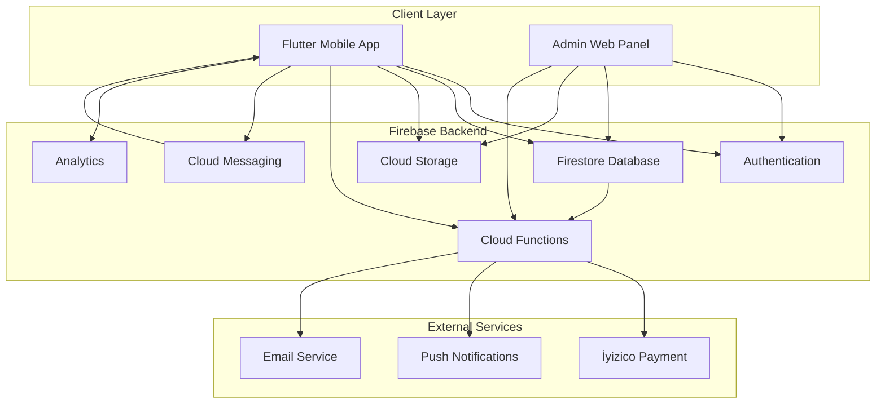

## 2. Veri Akış Diyagramı

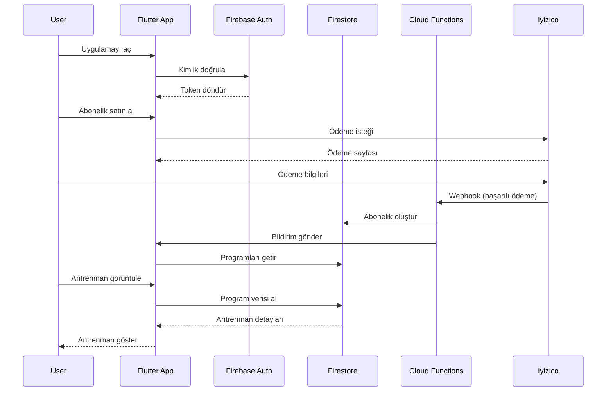

## 3. Kullanıcı Rolleri ve Yetkileri

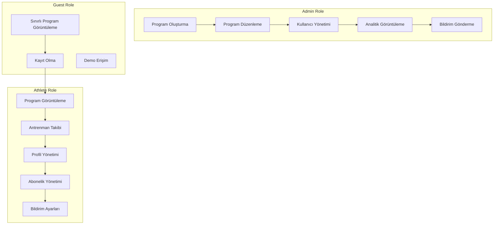

## 4. Firebase Servisleri Entegrasyonu

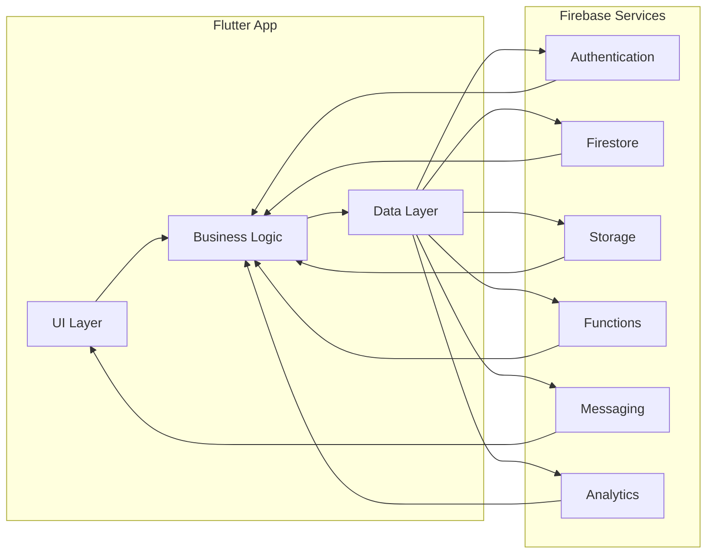

## 5. Abonelik Yaşam Döngüsü

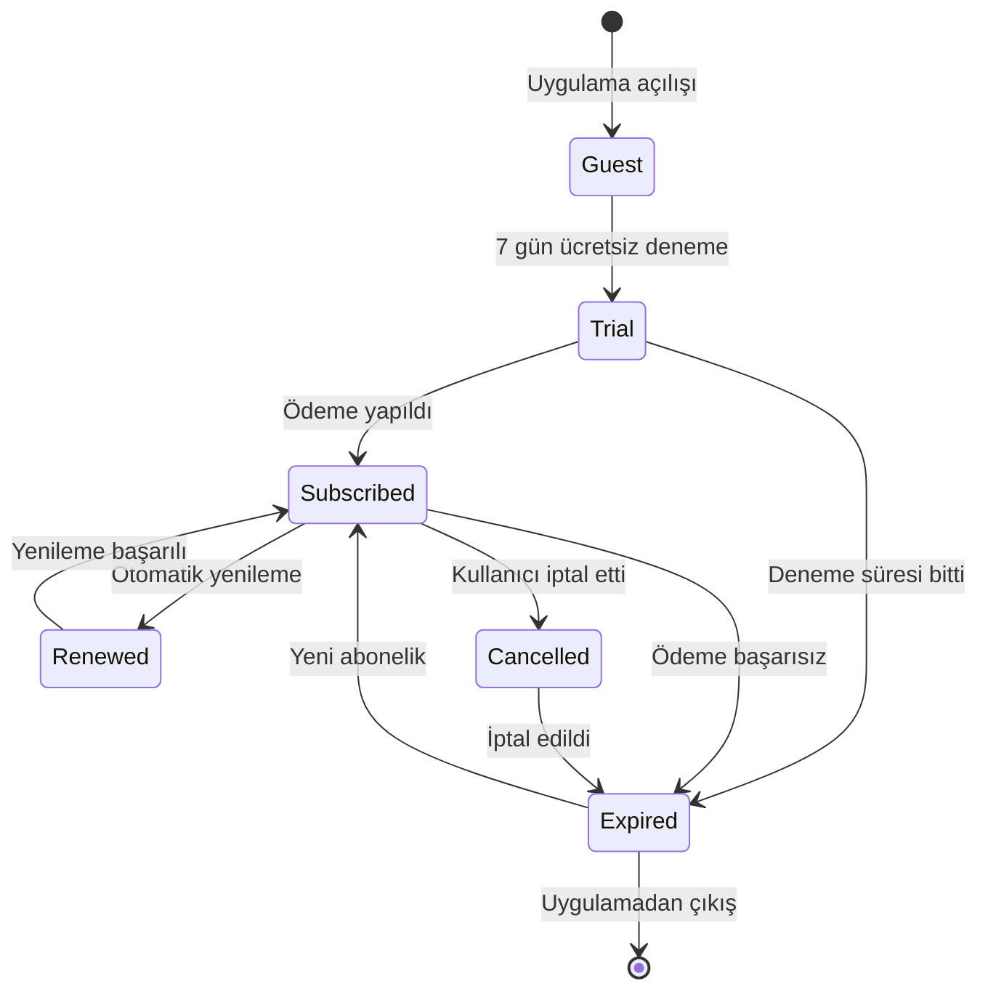

## 6. Bildirim Sistemi Akışı

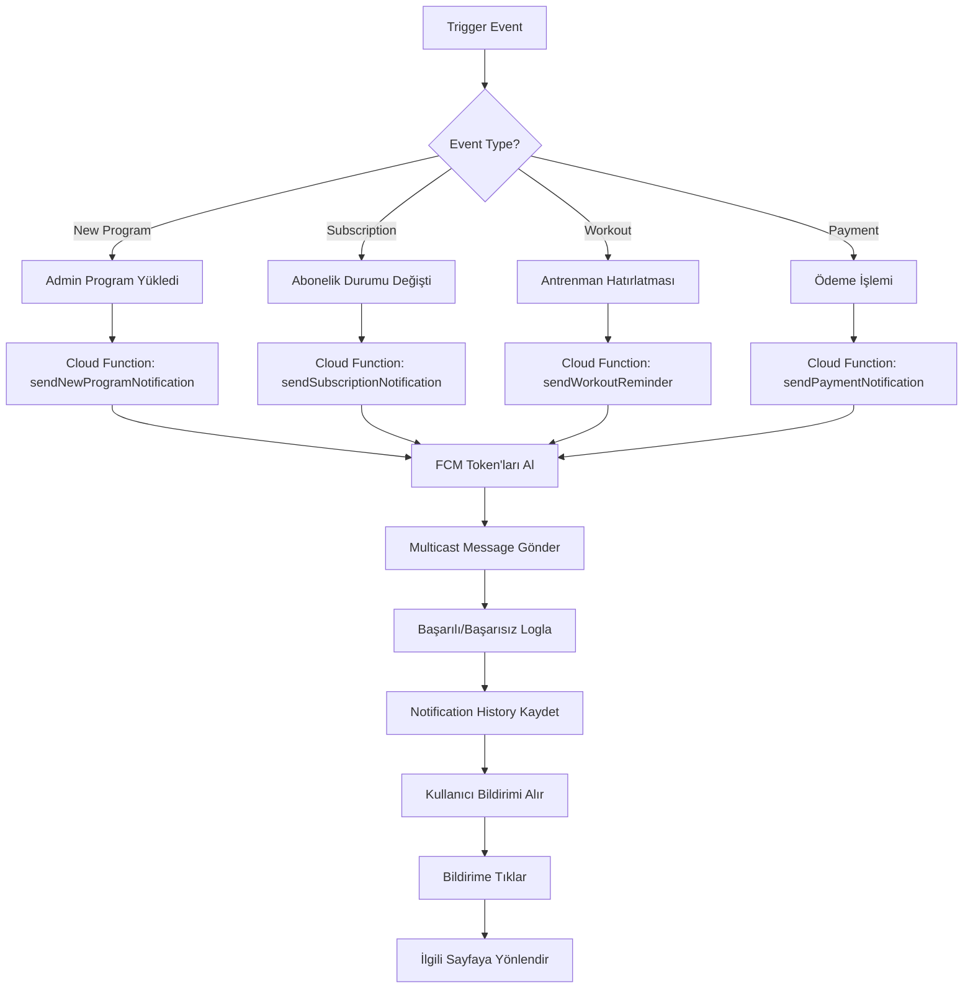

## 7. Veri Modeli İlişkileri

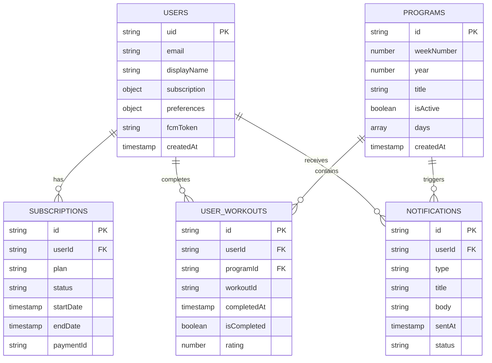

## 8. Güvenlik Katmanları

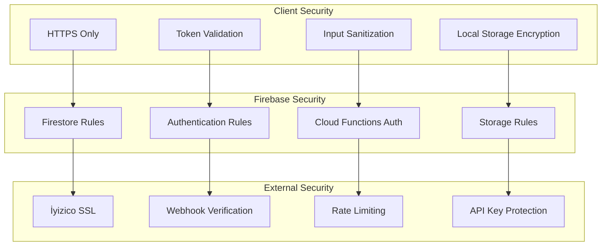

## 9. Performans Optimizasyonu

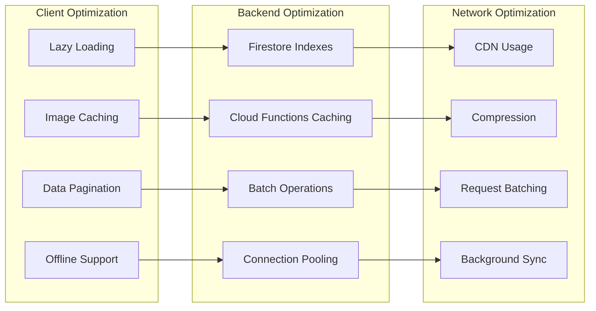

## 10. Hata Yönetimi ve Loglama

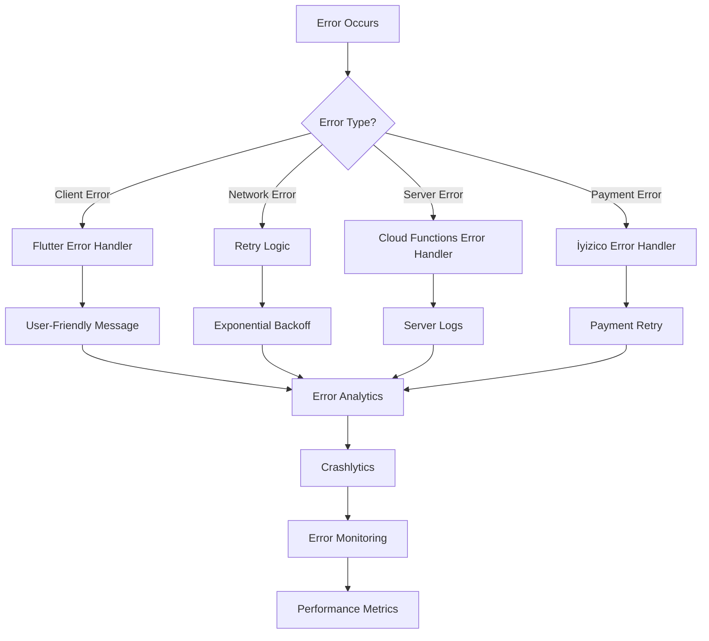

## 11. Test Stratejisi

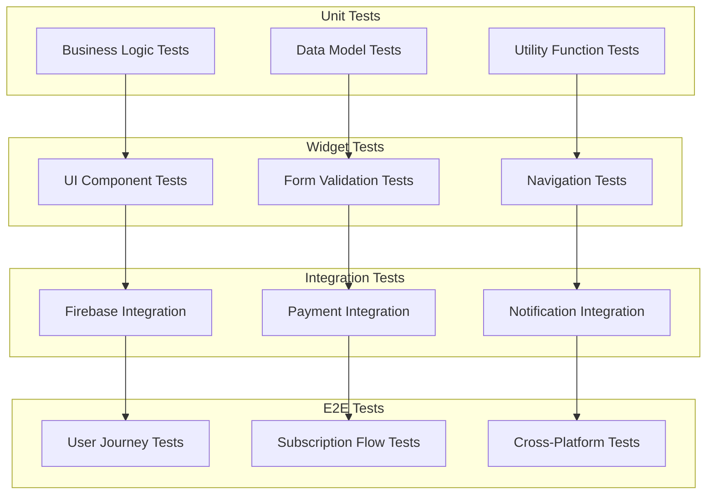

## 12. Deployment Pipeline

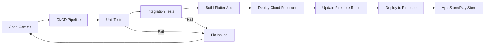

## 13. Monitoring ve Analytics

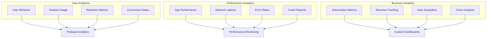

## 14. Backup ve Disaster Recovery

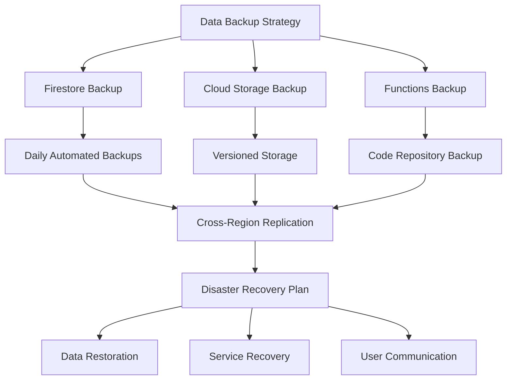

Bu mimari diyagramları, CrossFit antrenman uygulamasının tüm teknik yönlerini görsel olarak açıklamaktadır. Her diyagram, sistemin farklı bir katmanını veya sürecini detaylandırarak geliştirme ekibinin projeyi daha iyi anlamasını sağlar.
