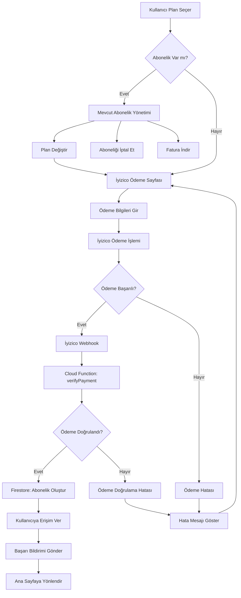

# Abonelik Modeli ve Ödeme Akışı

## Abonelik Planları ve Fiyatlandırma

### Plan Detayları

| Plan | Süre | Fiyat | Aylık Maliyet | İndirim |
|------|------|-------|---------------|---------|
| Aylık | 1 ay | ₺99 | ₺99 | - |
| 3 Aylık | 3 ay | ₺249 | ₺83 | %16 |
| 6 Aylık | 6 ay | ₺459 | ₺76.5 | %23 |
| 9 Aylık | 9 ay | ₺639 | ₺71 | %28 |
| Yıllık | 12 ay | ₺799 | ₺66.6 | %33 |

### Plan Özellikleri
- **Tüm planlar:** Sınırsız program erişimi
- **Tüm planlar:** Push notification desteği
- **Tüm planlar:** Çoklu dil desteği
- **Tüm planlar:** Offline cache (gelecek sürüm)
- **Tüm planlar:** 7 gün ücretsiz deneme

## Ödeme Akış Diyagramı



## İyizico Entegrasyonu

### 1. Flutter SDK Kurulumu

```yaml
# pubspec.yaml
dependencies:
  iyizico_flutter: ^1.0.0
  http: ^0.13.5
```

### 2. Ödeme Servisi

```dart
// lib/services/payment_service.dart
import 'package:iyizico_flutter/iyizico_flutter.dart';
import 'package:http/http.dart' as http;

class PaymentService {
  static const String _baseUrl = 'https://api.iyizico.com';
  static const String _apiKey = 'YOUR_API_KEY';
  static const String _secretKey = 'YOUR_SECRET_KEY';
  
  // Ödeme formu oluştur
  Future<PaymentResponse> createPayment({
    required String userId,
    required String plan,
    required double amount,
    required String currency,
  }) async {
    final paymentRequest = PaymentRequest(
      price: amount.toString(),
      paidPrice: amount.toString(),
      currency: currency,
      installment: 1,
      paymentChannel: 'WEB',
      paymentGroup: 'SUBSCRIPTION',
      conversationId: userId,
      callbackUrl: 'https://yourapp.com/payment/callback',
      items: [
        PaymentItem(
          id: plan,
          name: 'CrossFit Subscription - $plan',
          category1: 'Fitness',
          itemType: 'VIRTUAL',
          price: amount.toString(),
        ),
      ],
    );
    
    return await IyizicoFlutter.createPayment(paymentRequest);
  }
  
  // Ödeme durumu sorgula
  Future<PaymentStatus> checkPaymentStatus(String paymentId) async {
    final response = await http.post(
      Uri.parse('$_baseUrl/payment/check'),
      headers: {
        'Authorization': 'Bearer $_apiKey',
        'Content-Type': 'application/json',
      },
      body: jsonEncode({
        'paymentId': paymentId,
      }),
    );
    
    if (response.statusCode == 200) {
      final data = jsonDecode(response.body);
      return PaymentStatus.fromJson(data);
    }
    
    throw Exception('Payment status check failed');
  }
}
```

### 3. Ödeme Modeli

```dart
// lib/models/payment_models.dart
class PaymentRequest {
  final String price;
  final String paidPrice;
  final String currency;
  final int installment;
  final String paymentChannel;
  final String paymentGroup;
  final String conversationId;
  final String callbackUrl;
  final List<PaymentItem> items;
  
  PaymentRequest({
    required this.price,
    required this.paidPrice,
    required this.currency,
    required this.installment,
    required this.paymentChannel,
    required this.paymentGroup,
    required this.conversationId,
    required this.callbackUrl,
    required this.items,
  });
  
  Map<String, dynamic> toJson() => {
    'price': price,
    'paidPrice': paidPrice,
    'currency': currency,
    'installment': installment,
    'paymentChannel': paymentChannel,
    'paymentGroup': paymentGroup,
    'conversationId': conversationId,
    'callbackUrl': callbackUrl,
    'items': items.map((item) => item.toJson()).toList(),
  };
}

class PaymentItem {
  final String id;
  final String name;
  final String category1;
  final String itemType;
  final String price;
  
  PaymentItem({
    required this.id,
    required this.name,
    required this.category1,
    required this.itemType,
    required this.price,
  });
  
  Map<String, dynamic> toJson() => {
    'id': id,
    'name': name,
    'category1': category1,
    'itemType': itemType,
    'price': price,
  };
}

class PaymentResponse {
  final String status;
  final String paymentId;
  final String paymentPageUrl;
  final String token;
  
  PaymentResponse({
    required this.status,
    required this.paymentId,
    required this.paymentPageUrl,
    required this.token,
  });
  
  factory PaymentResponse.fromJson(Map<String, dynamic> json) {
    return PaymentResponse(
      status: json['status'],
      paymentId: json['paymentId'],
      paymentPageUrl: json['paymentPageUrl'],
      token: json['token'],
    );
  }
}

class PaymentStatus {
  final String status;
  final String paymentId;
  final double amount;
  final String currency;
  final DateTime paidAt;
  
  PaymentStatus({
    required this.status,
    required this.paymentId,
    required this.amount,
    required this.currency,
    required this.paidAt,
  });
  
  factory PaymentStatus.fromJson(Map<String, dynamic> json) {
    return PaymentStatus(
      status: json['status'],
      paymentId: json['paymentId'],
      amount: json['amount'].toDouble(),
      currency: json['currency'],
      paidAt: DateTime.parse(json['paidAt']),
    );
  }
}
```

## Cloud Functions - Ödeme Doğrulama

### 1. Ödeme Webhook Handler

```javascript
// functions/src/payment.js
const functions = require('firebase-functions');
const admin = require('firebase-admin');
const crypto = require('crypto');

// İyizico webhook'u işle
exports.handlePaymentWebhook = functions.https.onRequest(async (req, res) => {
  try {
    // Webhook doğrulama
    const signature = req.headers['x-iyzico-signature'];
    const body = JSON.stringify(req.body);
    const expectedSignature = crypto
      .createHmac('sha256', process.env.IYIZICO_WEBHOOK_SECRET)
      .update(body)
      .digest('hex');
    
    if (signature !== expectedSignature) {
      console.error('Invalid webhook signature');
      return res.status(401).send('Unauthorized');
    }
    
    const { paymentId, status, amount, currency, userId } = req.body;
    
    if (status === 'success') {
      await processSuccessfulPayment({
        paymentId,
        amount,
        currency,
        userId
      });
    } else {
      await processFailedPayment({
        paymentId,
        userId,
        reason: status
      });
    }
    
    res.status(200).send('OK');
  } catch (error) {
    console.error('Webhook processing error:', error);
    res.status(500).send('Internal Server Error');
  }
});

// Başarılı ödeme işle
async function processSuccessfulPayment({ paymentId, amount, currency, userId }) {
  const db = admin.firestore();
  const batch = db.batch();
  
  // Abonelik planını belirle
  const plan = determinePlanFromAmount(amount);
  const subscriptionData = createSubscriptionData(plan, paymentId);
  
  // Kullanıcı abonelik bilgilerini güncelle
  const userRef = db.collection('users').doc(userId);
  batch.update(userRef, {
    'subscription.plan': plan,
    'subscription.isActive': true,
    'subscription.startDate': admin.firestore.FieldValue.serverTimestamp(),
    'subscription.endDate': calculateEndDate(plan),
    'subscription.paymentId': paymentId,
    'subscription.autoRenew': true
  });
  
  // Abonelik geçmişini kaydet
  const subscriptionRef = db.collection('subscriptions').doc();
  batch.set(subscriptionRef, subscriptionData);
  
  // Başarı bildirimi gönder
  await sendPaymentSuccessNotification(userId, plan);
  
  await batch.commit();
  console.log(`Payment processed successfully for user ${userId}`);
}

// Başarısız ödeme işle
async function processFailedPayment({ paymentId, userId, reason }) {
  const db = admin.firestore();
  
  // Başarısız ödeme kaydı
  await db.collection('subscriptions').add({
    userId,
    paymentId,
    status: 'failed',
    amount: 0,
    currency: 'TRY',
    createdAt: admin.firestore.FieldValue.serverTimestamp(),
    failureReason: reason
  });
  
  // Hata bildirimi gönder
  await sendPaymentFailedNotification(userId, reason);
  
  console.log(`Payment failed for user ${userId}: ${reason}`);
}

// Plan belirleme
function determinePlanFromAmount(amount) {
  const plans = {
    9900: 'monthly',
    24900: 'quarterly',
    45900: 'semi-annual',
    63900: '9-month',
    79900: 'yearly'
  };
  
  return plans[amount] || 'monthly';
}

// Abonelik verisi oluştur
function createSubscriptionData(plan, paymentId) {
  const now = new Date();
  const endDate = calculateEndDate(plan);
  
  return {
    userId: admin.auth().currentUser.uid,
    plan,
    status: 'active',
    startDate: admin.firestore.FieldValue.serverTimestamp(),
    endDate: admin.firestore.Timestamp.fromDate(endDate),
    paymentId,
    amount: getPlanAmount(plan),
    currency: 'TRY',
    autoRenew: true,
    nextBillingDate: admin.firestore.Timestamp.fromDate(endDate),
    createdAt: admin.firestore.FieldValue.serverTimestamp()
  };
}

// Bitiş tarihi hesapla
function calculateEndDate(plan) {
  const now = new Date();
  const planDurations = {
    'monthly': 1,
    'quarterly': 3,
    'semi-annual': 6,
    '9-month': 9,
    'yearly': 12
  };
  
  const months = planDurations[plan];
  return new Date(now.getFullYear(), now.getMonth() + months, now.getDate());
}

// Plan fiyatını al
function getPlanAmount(plan) {
  const amounts = {
    'monthly': 9900,
    'quarterly': 24900,
    'semi-annual': 45900,
    '9-month': 63900,
    'yearly': 79900
  };
  
  return amounts[plan];
}
```

### 2. Abonelik Yenileme Kontrolü

```javascript
// functions/src/subscription.js
const functions = require('firebase-functions');
const admin = require('firebase-admin');

// Günlük abonelik kontrolü (cron job)
exports.checkExpiringSubscriptions = functions.pubsub
  .schedule('0 9 * * *') // Her gün saat 09:00
  .timeZone('Europe/Istanbul')
  .onRun(async (context) => {
    const db = admin.firestore();
    const now = new Date();
    const threeDaysFromNow = new Date(now.getTime() + (3 * 24 * 60 * 60 * 1000));
    
    // 3 gün içinde bitecek abonelikleri bul
    const expiringSubscriptions = await db.collection('users')
      .where('subscription.isActive', '==', true)
      .where('subscription.endDate', '<=', admin.firestore.Timestamp.fromDate(threeDaysFromNow))
      .get();
    
    for (const doc of expiringSubscriptions.docs) {
      const user = doc.data();
      await sendSubscriptionReminderNotification(doc.id, user);
    }
    
    console.log(`Checked ${expiringSubscriptions.size} expiring subscriptions`);
  });

// Süresi dolmuş abonelikleri iptal et
exports.cancelExpiredSubscriptions = functions.pubsub
  .schedule('0 0 * * *') // Her gün saat 00:00
  .timeZone('Europe/Istanbul')
  .onRun(async (context) => {
    const db = admin.firestore();
    const now = new Date();
    
    // Süresi dolmuş abonelikleri bul
    const expiredSubscriptions = await db.collection('users')
      .where('subscription.isActive', '==', true)
      .where('subscription.endDate', '<=', admin.firestore.Timestamp.fromDate(now))
      .get();
    
    const batch = db.batch();
    
    for (const doc of expiredSubscriptions.docs) {
      // Aboneliği iptal et
      batch.update(doc.ref, {
        'subscription.isActive': false,
        'subscription.cancelledAt': admin.firestore.FieldValue.serverTimestamp()
      });
      
      // Abonelik geçmişini güncelle
      const subscriptionRef = db.collection('subscriptions').doc();
      batch.set(subscriptionRef, {
        userId: doc.id,
        status: 'expired',
        cancelledAt: admin.firestore.FieldValue.serverTimestamp(),
        reason: 'expired'
      });
      
      // Kullanıcıya bildirim gönder
      await sendSubscriptionExpiredNotification(doc.id);
    }
    
    await batch.commit();
    console.log(`Cancelled ${expiredSubscriptions.size} expired subscriptions`);
  });
```

## Abonelik Yönetimi

### 1. Plan Değiştirme

```dart
// lib/services/subscription_service.dart
class SubscriptionService {
  final FirebaseFirestore _firestore = FirebaseFirestore.instance;
  final PaymentService _paymentService = PaymentService();
  
  // Plan değiştir
  Future<bool> changePlan(String newPlan) async {
    try {
      final user = FirebaseAuth.instance.currentUser;
      if (user == null) return false;
      
      // Mevcut aboneliği iptal et
      await cancelCurrentSubscription();
      
      // Yeni plan satın al
      final amount = getPlanAmount(newPlan);
      final paymentResponse = await _paymentService.createPayment(
        userId: user.uid,
        plan: newPlan,
        amount: amount,
        currency: 'TRY',
      );
      
      return paymentResponse.status == 'success';
    } catch (e) {
      print('Plan change error: $e');
      return false;
    }
  }
  
  // Mevcut aboneliği iptal et
  Future<void> cancelCurrentSubscription() async {
    final user = FirebaseAuth.instance.currentUser;
    if (user == null) return;
    
    await _firestore.collection('users').doc(user.uid).update({
      'subscription.isActive': false,
      'subscription.cancelledAt': FieldValue.serverTimestamp(),
      'subscription.autoRenew': false,
    });
  }
  
  // Abonelik durumunu kontrol et
  Future<SubscriptionStatus> checkSubscriptionStatus() async {
    final user = FirebaseAuth.instance.currentUser;
    if (user == null) return SubscriptionStatus.none;
    
    final doc = await _firestore.collection('users').doc(user.uid).get();
    final data = doc.data();
    
    if (data == null) return SubscriptionStatus.none;
    
    final subscription = data['subscription'] as Map<String, dynamic>?;
    if (subscription == null) return SubscriptionStatus.none;
    
    final isActive = subscription['isActive'] as bool? ?? false;
    final endDate = (subscription['endDate'] as Timestamp?)?.toDate();
    
    if (!isActive) return SubscriptionStatus.none;
    if (endDate == null) return SubscriptionStatus.none;
    
    final now = DateTime.now();
    if (endDate.isBefore(now)) {
      return SubscriptionStatus.expired;
    }
    
    final daysUntilExpiry = endDate.difference(now).inDays;
    if (daysUntilExpiry <= 3) {
      return SubscriptionStatus.expiring;
    }
    
    return SubscriptionStatus.active;
  }
}

enum SubscriptionStatus {
  none,
  active,
  expiring,
  expired,
}
```

### 2. Abonelik UI Bileşenleri

```dart
// lib/widgets/subscription_card.dart
class SubscriptionCard extends StatelessWidget {
  final String plan;
  final int price;
  final int monthlyPrice;
  final double discount;
  final bool isSelected;
  final VoidCallback onTap;
  
  const SubscriptionCard({
    Key? key,
    required this.plan,
    required this.price,
    required this.monthlyPrice,
    required this.discount,
    required this.isSelected,
    required this.onTap,
  }) : super(key: key);
  
  @override
  Widget build(BuildContext context) {
    return GestureDetector(
      onTap: onTap,
      child: Container(
        margin: const EdgeInsets.symmetric(vertical: 8),
        padding: const EdgeInsets.all(16),
        decoration: BoxDecoration(
          border: Border.all(
            color: isSelected ? Colors.blue : Colors.grey.shade300,
            width: isSelected ? 2 : 1,
          ),
          borderRadius: BorderRadius.circular(12),
          color: isSelected ? Colors.blue.shade50 : Colors.white,
        ),
        child: Column(
          crossAxisAlignment: CrossAxisAlignment.start,
          children: [
            Row(
              mainAxisAlignment: MainAxisAlignment.spaceBetween,
              children: [
                Text(
                  plan,
                  style: const TextStyle(
                    fontSize: 18,
                    fontWeight: FontWeight.bold,
                  ),
                ),
                if (discount > 0)
                  Container(
                    padding: const EdgeInsets.symmetric(horizontal: 8, vertical: 4),
                    decoration: BoxDecoration(
                      color: Colors.green,
                      borderRadius: BorderRadius.circular(12),
                    ),
                    child: Text(
                      '%${(discount * 100).toInt()} İndirim',
                      style: const TextStyle(
                        color: Colors.white,
                        fontSize: 12,
                        fontWeight: FontWeight.bold,
                      ),
                    ),
                  ),
              ],
            ),
            const SizedBox(height: 8),
            Text(
              '₺${(price / 100).toStringAsFixed(0)}',
              style: const TextStyle(
                fontSize: 24,
                fontWeight: FontWeight.bold,
                color: Colors.blue,
              ),
            ),
            if (monthlyPrice != price)
              Text(
                'Aylık ₺${(monthlyPrice / 100).toStringAsFixed(0)}',
                style: TextStyle(
                  fontSize: 14,
                  color: Colors.grey.shade600,
                ),
              ),
            const SizedBox(height: 8),
            const Text(
              '• Sınırsız program erişimi\n• Push bildirimleri\n• Çoklu dil desteği\n• Offline cache',
              style: TextStyle(fontSize: 14),
            ),
          ],
        ),
      ),
    );
  }
}
```

## Güvenlik Önlemleri

### 1. Ödeme Güvenliği
- **HTTPS Zorunluluğu:** Tüm ödeme işlemleri HTTPS üzerinden
- **Webhook Doğrulama:** İyizico webhook'ları imza ile doğrulanır
- **Veri Şifreleme:** Hassas ödeme verileri şifrelenir
- **Rate Limiting:** API çağrıları sınırlandırılır

### 2. Abonelik Güvenliği
- **Firestore Rules:** Sadece yetkili kullanıcılar abonelik verilerine erişebilir
- **Token Doğrulama:** JWT token'lar doğrulanır
- **Oturum Yönetimi:** Güvenli oturum yönetimi
- **Audit Log:** Tüm abonelik değişiklikleri loglanır

Bu abonelik modeli, kullanıcı dostu bir deneyim sunarken güvenli ve ölçeklenebilir bir ödeme sistemi sağlar. İyizico entegrasyonu ile güvenilir ödeme işlemleri gerçekleştirilir ve Cloud Functions ile otomatik abonelik yönetimi sağlanır.
